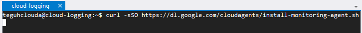
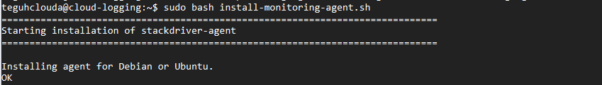

# Google Cloud Platform

## Work Instruction for Using Cloud Logging

1. Before we run cloud logging, we need create VM which will be monitored. 
    

2. Then connect to the vm, and run web server (I am using apache web server). 
   Run this command : “sudo apt-get install apache2”
    

3. Run this command for install agent to the vm :
   “curl -sSO https://dl.google.com/cloudagents/install-monitoring-agent.sh”
    
   
4. “sudo bash install-monitoring-agent.sh”
    

5. Run this command for install cloud log to the vm :
   “curl -sSO https://dl.google.com/cloudagents/install-logging-agent.sh”
   “sudo bash install-logging-agent.sh –structured”
    

6. The go to the Cloud Logging menu. You can see all log from your vm. 
    

7. You can choose name log what you want to see. For this case, I want to see apache error log. Go to this and click.
    

8. This view is apache log detail in cloud logging.
    

9. You can export the log, just click create sink.
    

10. Fill the sink name and description. Then click next.
    

11. Fill the sink destination. You can follow this option. For this option I create new bucket just for this log.
    

12. Fill the bucket detail.
    

13. Set the retention date and create the bucket.
    

14. Click next.
    

15. Let it default. Then next
    

16. Then create sink (number 4 is just optional, you can skip for it).
    

17. The sink has been created. You should waiting for this log. Data should available soon.
    

18. You can see, the bucket still 0 mb.
    

19. Done, Thanks

